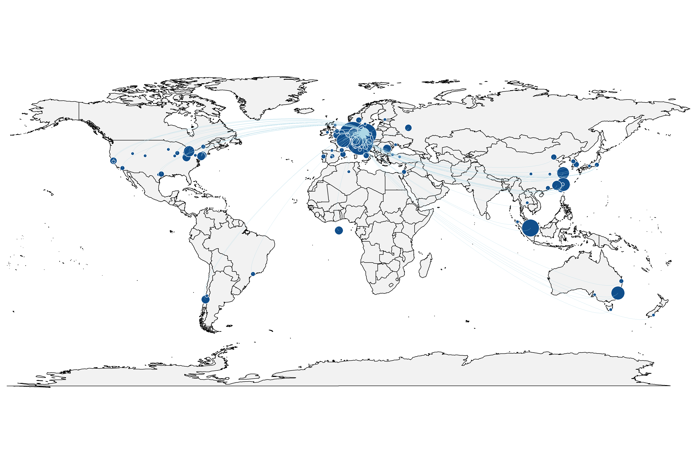
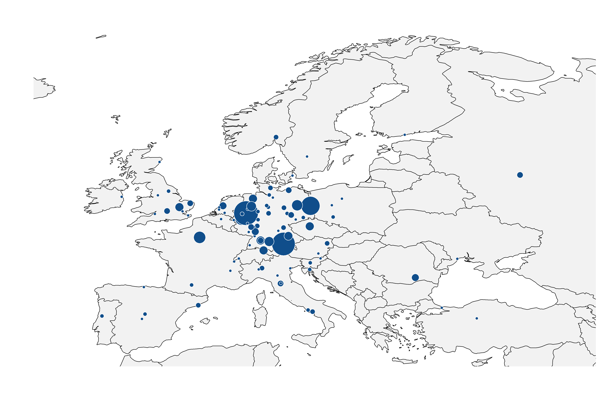
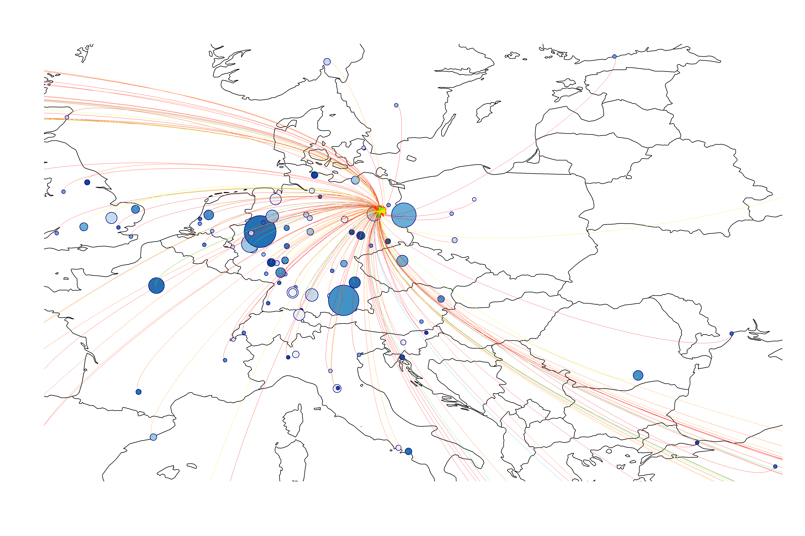


[](http://quantlet.de/index.php?p=info)

## [](http://quantlet.de/) **CRCmapgu** [](http://quantlet.de/d3/ia)


```yaml


Name of QuantLet : CRCmapgu

Published in : CRC - Evaluating Research Performance of the Collaborative Research Center 649

Description : 'Produces a map of university locations of guest researchers who visited the CRC from 2005 
to 2016, June'

Keywords : 'plot, map, multivariate, analysis, descriptive, descriptive-methods, distribution, 
graphical representation, visualization, data visualization'

Author : Alona Zharova, Janine Tellinger-Rice, Wolfgang Karl Härdle

Submitted : Sun, October 16 2016 by Nicole Hermann, Alona Zharova

Datafile : 'edges.txt - The data set contains the name of city where the guest researcher comes from,
the latitude and longitude data of each city and the total number of visits made from the corresponding city
from 2005 to 2016, June'

Output : 
- 1: 'World map of university locations of guest researchers who visited the CRC from 2005 to 2016, June'
- 2: 'Map of Europe with university locations of guest researchers who visited the CRC from 2005 to 2016, June'
- 3: 'MAp of Germany and close countries with university locations of guest researchers who visited the CRC
from 2005 to 2016, June' 
```








```r

# Close windows and clear variables
graphics.off()
rm(list = ls(all = TRUE))

# Install packages / Load library
libraries = c("maps", "diagram", "plotrix", "rworldmap", "RColorBrewer")
lapply(libraries, function(x) if (!(x %in% installed.packages())) {install.packages(x)})
lapply(libraries, library, quietly = TRUE, character.only = TRUE)
palette(rainbow(20))

# Load data
edges = read.table("edges.txt", header=TRUE)

# Set font and color for output, depending on choice
numdata        = length(edges)
blues          = brewer.pal(numdata, "Blues")
blues.rev      = rev(blues)
font           = "serif" # Font Times
res            = 300     # resolution
width          = 15      # width of plot pdf
height         = 10      # height of plot pdf

# Plot map of the world with university locations of guest researchers of CRC
png(file = "CRCmapgu_world.png", width = width, height = height, units = "in", res = res, family = font)
map(col="#f2f2f2", fill=TRUE, bg="white", mar = rep(0, 4)) 
with(edges, points(long.y, lat.y, col="white", bg="dodgerblue4", pch=21, cex=rescale(col, c(1, 8)))) 
apply(edges[, -(1:2)], 1, function(x) curvedarrow(to=x[3:4], from=x[1:2], lcol="lightblue", curve=.1, endhead=FALSE, arr.pos = 0, lwd=.1))
dev.off() 

# Plot map of the europe with university locations of guest researchers of CRC
png(file = "CRCmapgu_eur.png", width = width, height = height, units = "in", res = res, family = font)
newmap = getMap(resolution = "low")
plot(newmap, xlim = c(0, 30), ylim = c(36, 70), col="#f2f2f2", asp = 1)
with(edges, points(long.y, lat.y, col="white", bg="dodgerblue4", pch=21, cex=rescale(col, c(1, 8)))) 
dev.off() 

# Plot map of Germany including some european countries
png(file = "CRCmapgu_germ.png", width = width, height = height, units = "in", res = res, family = font)
newmap = getMap(resolution = "low")
plot(newmap, xlim = c(10, 20), ylim = c(40, 60),  asp = 1)
with(edges, points(long.y, lat.y, col="darkblue", bg=blues, pch=21, cex=rescale(col, c(1, 8)))) 
apply(edges[, -(1:2)], 1, function(x) curvedarrow(to=x[3:4], from=x[1:2], lcol=x[5], curve=.1, endhead=FALSE, arr.pos = 0, lwd=.1))
dev.off() 


```
