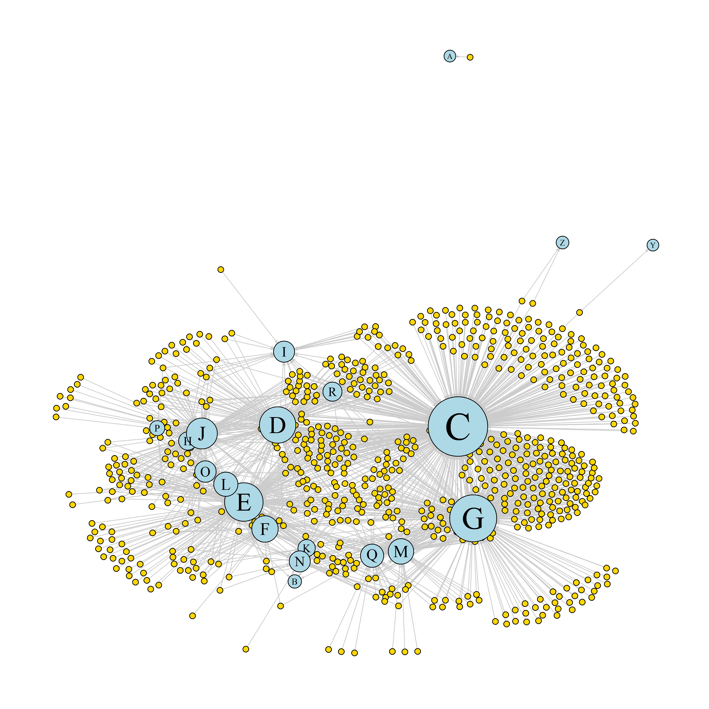


[](http://quantlet.de/index.php?p=info)

## [](http://quantlet.de/) **CRCnetjel** [](http://quantlet.de/d3/ia)


```yaml

Name of QuantLet : CRCnetjel

Published in : CRC - Evaluating Research Performance of Collaborative Research Center

Description : 'Network map of of collaborating disciplines in CRC 649 
according to JEL classification'

Keywords : 'plot, analysis, visualization, data visualization, discriptive 
methods, distribution, graphical representation, descriptive'

Author : Alona Zharova

Submitted : Thu, August 04 2016 by Alona Zharova

Datafile : 'CRCDP.csv - The data set contains 776 discussion papers (DP) with 
authors, DP IDs, year of publication, link to the quantlet (if available), 
date of issue, CRC subproject's number of authors and JEL codes of DP'

Output : 'Network of 760 discussion papers (yellow) and 20 JEL codes (blue) 
published from 2005 to 2016, June'


```




```r


# Close windows and clear variables
graphics.off()
rm(list = ls(all = TRUE))

# Install packages / Load library
libraries = c("igraph")
lapply(libraries, function(x) if (!(x %in% installed.packages())) {install.packages(x)})
lapply(libraries, library, quietly = TRUE, character.only = TRUE)

##===============================================##
# Data preparation

test  = TRUE
corrections = TRUE

# Load data
crcdp = read.csv("CRCDP.csv", header = TRUE, as.is = TRUE, sep = ";")

# Create id column
crcdp$id = gsub(pattern = "SFB649DP|.pdf", replacement = "", x = crcdp$DP_FileName)

# Check if there are mistakes or missing JEL
if (test){
  # wrong ids, too long ids
  crcdp[nchar(crcdp$id) != 8, "id"]
  # Papers without any JEL:
  sum(crcdp$JEL == ""|crcdp$JEL == "\n ")
  crcdp[crcdp$JEL == ""|crcdp$JEL == "\n ",]
  crcdp = crcdp[!(crcdp$JEL == ""|crcdp$JEL == "\n "),]
}

# Create column with SP project area
crcdp$SP = gsub(pattern = "[[:digit:]]|[[:punct:]]|[[:space:]]", replacement = "",
                x = crcdp$DP_ProjectsName)
crcdp$SP = strtrim(crcdp$SP, 1) # leave only one letter of first SP

# Create other columns
crcdp$outlet.name = crcdp$DP_Titel
crcdp$outlet.type = NA
        crcdp$art = 2
     crcdp$outlet = crcdp$DP_FileName

# Prepare function for splitting of JEL codes into different columns
jel_split = function(string){
  string = gsub(pattern = "[[:digit:]]|[[:space:]]",replacement = "", string)
  return(strsplit(x = string, split = "[[:punct:]]")[[1]])
}

# Fixe mistakes in JEL column
if(corrections){
  crcdp$JEL = gsub(pattern = "and", replacement = ",", x = crcdp$JEL)
  crcdp$JEL = gsub(pattern = "\nE44\nF34", replacement = "\nE44,\nF34", 
                   x = crcdp$JEL)
  crcdp$JEL = gsub(pattern = "\003", replacement = "", x = crcdp$JEL)
  crcdp$JEL = gsub(pattern = "GO", replacement = "G0", x = crcdp$JEL)
}

# Prepare Nodes Data Frame
crcdp1 = crcdp[, c("id", "outlet", "outlet.type", "outlet.name", "art", "SP")]
crcdp2 = data.frame(id = sort(unique(unlist(lapply(X = crcdp$JEL, FUN = jel_split)))),
                    outlet = sort(unique(unlist(lapply(X = crcdp$JEL,FUN = jel_split)))),
                    outlet.type = 1,
                    outlet.name = sort(unique(unlist(lapply(X = crcdp$JEL,FUN = jel_split)))),
                    art = 1,
                    SP = NA,
                    stringsAsFactors = FALSE
)

if (test){
  tmp = vector()
  for (i in 1:length(crcdp2$id)){
    tmp[i] = any(crcdp2$id[i] == toupper(letters))
  }
  # wrong JEL codes
  crcdp2$id[!tmp]
}

# Write Nodes Data Frame
crcdp_output = rbind(crcdp1, crcdp2)
write.csv(x = crcdp_output, file = "CRCnetjel_nodes.csv", row.names = FALSE)


# Prepare Edges Data Frame
crced = data.frame()
crced_entry = function(crced, from, to, weight){
                   tmp.num = dim(crced)[1] + 1
    crced[tmp.num, "from"] = from
      crced[tmp.num, "to"] = to
  crced[tmp.num, "weight"] = weight
  return(crced)
}

for (tid in crcdp$id){
  num = grep(pattern = tid, crcdp$id)
  # crcdp[num, "JEL"]
  jel = table(jel_split(crcdp[num, "JEL"]))
  # if any(nchar(names(jel))>1)
  for (let in names(jel)){
    crced = crced_entry(crced, from = tid, to = let, weight = jel[let])
  }
}

if (test)
  crced[nchar(crced$to) != 1, ]

# Write Edges Data Frame
write.csv(x = crced, file = "CRCnetjel_edges.csv", row.names = FALSE)

##===============================================##
# Ploting

# Read data
nodesdp = read.csv("CRCnetjel_nodes.csv", header = TRUE, as.is = TRUE)
linksdp = read.csv("CRCnetjel_edges.csv", header = TRUE, as.is = TRUE)

# Examine the data:
head(nodesdp)
head(linksdp)
nrow(nodesdp); length(unique(nodesdp$id))
nrow(linksdp); nrow(unique(linksdp[, c("from", "to")]))

linksdp = linksdp[order(linksdp$from, linksdp$to), ]

# Convert the data to an igraph object:
net = graph.data.frame(linksdp, nodesdp, directed = TRUE) 

# Examine the resulting object:
class(net)
net

# Remove loops from the graph:
net = simplify(net, remove.multiple = FALSE, remove.loops = TRUE) 

# Access nodes, edges, and their attributes:
E(net)
V(net)
V(net)$outlet
V(net)$outlet.type
V(net)$outlet.name
V(net)$art
head(E(net))

# Generate colors based on type_node:
       colrs = c("light blue", "gold")
V(net)$color = colrs[V(net)$art]

# Change arrow size and edge color:
E(net)$arrow.size = 0.2

# Compute node degrees (#links) and use that to set node size:
        deg = igraph::degree(net, mode = "all")
V(net)$size = (deg)^0.5
      sizes = V(net)$size[V(net)$art == 1]
a = 4
b = 20
V(net)$size = (V(net)$size-min(sizes))/(max(sizes)-min(sizes))*(b-a)+a 
# V(net)$size[V(net)$art==1] = max(V(net)$size[V(net)$art==2])
V(net)$size[V(net)$art == 2] = 2

# JEL codes will have name labels, DPs will not:
V(net)$label = ""
V(net)$label[V(net)$type == FALSE] = nodesdp$outlet[V(net)$type == FALSE]
V(net)$label.cex = V(net)$size/6
V(net)$label.font = 1 # 2: bold labels
V(net)$label.family = "serif" # serif, sans, mono, symbol

# Plot
png(file = "CRCnetjel1.png", width = 10, height = 10, units="in", res = 600)
par(mar = c(0, 0, 0, 0))
plot(net,
     vertex.label = ifelse(!is.na(V(net)$outlet.type), V(net)$outlet.name, NA),
     vertex.label.color = "black",
     edge.color = "gray80"
#    ,vertex.size = ifelse(!is.na(V(net)$outlet.type),6,2) 
)
dev.off()

##===============================================##
# Highlighting aspects of the network
png(file = "CRCnetjelhis.png")
  hist(linksdp$weight)
  mean(linksdp$weight)
  sd(linksdp$weight)
dev.off()

##===============================================##
# Check layouts available for our network
png(file = "CRCnetjellayouts.png")
layouts = grep("^layout_", ls("package:igraph"), value=TRUE)[-1]
layouts = layouts[!grepl("bipartite|merge|norm|sugiyama|tree", layouts)]
par(mfrow=c(3,5), mar=c(1,1,1,1))
for (layout in layouts) {
  print(layout)
  l = do.call(layout, list(net))
  plot(net, edge.arrow.mode=0, layout=l, main=layout) }
dev.off()


##===============================================##
# Animation

tkid = tkplot(net) # tkid is the id of the tkplot that will open
   l = tkplot.getcoords(tkid) # grab the coordinates from tkplot
plot(net, layout = l)


# Literature:
  # http://igraph.org/r/
  # http://kateto.net/networks-r-igraph
  # www.kateto.net/wordpress/wp-content/uploads/2016/01/NetSciX_2016_Workshop.pdf

```
